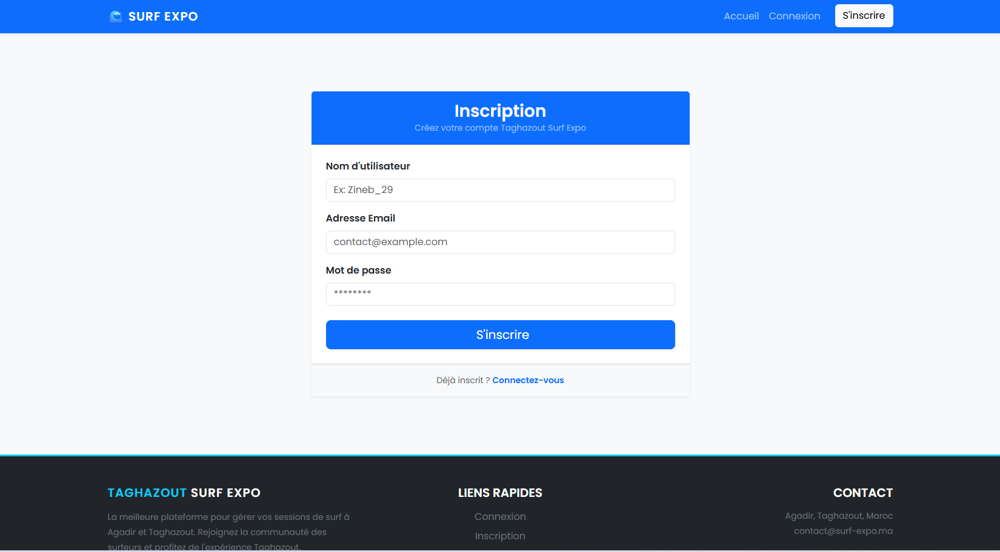

# 🌊 Taghazout Surf Expo - Plateforme de Gestion MVC

Ce projet est une application web développée en **PHP** suivant l'architecture **MVC**. Elle est conçue pour gérer les inscriptions et les connexions des surfeurs pour l'événement "Taghazout Surf Expo".

---

## 🛠️ Stack Technique

- **Backend :** PHP 8 (Architecture MVC pure)
- **Base de données :** MySQL avec extension **PDO** (Sécurité contre SQL Injection)
- **Sécurité :** Hachage des mots de passe avec `password_hash` (BCRYPT)
- **Frontend :** Bootstrap 5 & Lucide/Bootstrap Icons

---

## 🧠 Logique de Fonctionnement (Workflow)

Le projet est structuré pour séparer la logique métier de l'affichage :

1. **Routeur (`public/index.php`) :** Reçoit toutes les requêtes et appelle le contrôleur approprié selon l'action (`register`, `login`, `home`).
2. **Contrôleur (`App/controllers/`) :** - Récupère et nettoie les données (`$_POST`).
   - Gère la sécurité (hachage du mot de passe).
   - Décide quelle vue afficher.
3. **Modèle (`App/models/`) :** Contient uniquement les requêtes SQL (Ex: `INSERT INTO users`, `SELECT * FROM users`).
4. **Vue (`App/views/`) :** Affiche les interfaces HTML à l'utilisateur final.

---

## ✅ Fonctionnalités Implémentées

### 1. Inscription (Register)
- Validation des données côté serveur.
- Hachage sécurisé du mot de passe avant stockage.
- Redirection automatique vers la page de connexion après succès.

### 2. Connexion (Login)
- Récupération de l'utilisateur par son email via le Modèle.
- Vérification du mot de passe avec `password_verify()`.
- [À venir] Gestion des sessions utilisateur.

### 3. Page d'Accueil (Home)
- Récupération dynamique de la liste des surfeurs depuis la base de données.
- Affichage sous forme de **Cards Responsive** avec Bootstrap.

---

## 📂 Structure des Dossiers

```text
├── App/
│   ├── controllers/    # Logique (AuthController.php)
│   ├── models/         # Requêtes SQL (User.php)
│   └── views/          # Interfaces (home.php, register.php, login.php)
│       └── layout/     # Éléments réutilisables (header, footer)
├── public/
│   └── index.php       # Point d'entrée unique
└── config/             # Connexion PDO


### 1.DASHBOARD INSCRIPTION
